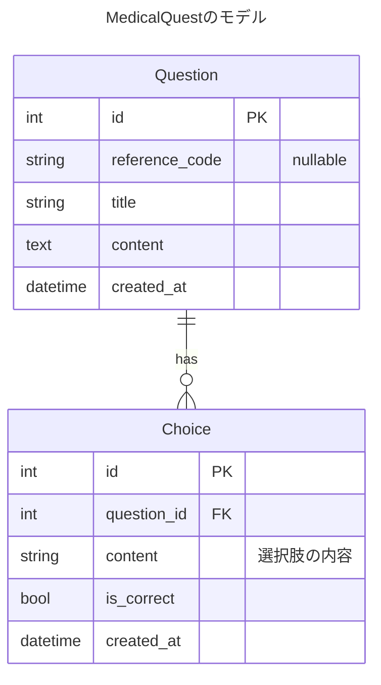

# MedicalQuest アーキテクチャ設計

## データベース設計



## アーキテクチャ設計

MedicalQuestはオニオンアーキテクチャに近い形で構築されています：

```
+---------------------+
|                     |
|     Application     | コマンドライン(CLI)やWeb API(Echo)などの
|       Layer         | 外部とのインターフェース
|                     |
+----------+----------+
           |
           v
+----------+----------+
|                     |
|      Domain         | ビジネスロジックを含むドメイン層
|       Layer         | (Entity, Repository Interface)
|                     |
+----------+----------+
           |
           v
+----------+----------+
|                     |
|  Infrastructure     | 技術的な実装（DB接続、ORM等）
|       Layer         |
|                     |
+---------------------+
```

## パッケージ構造

```
medicalquest/
├── cmd/                    # アプリケーションのエントリーポイント
│   ├── api/                # API サーバー (Echo)
│   └── cli/                # CLI アプリケーション
│
├── config/                 # アプリケーション設定
│
├── domain/                 # ドメイン層
│   ├── entity/             # ドメインエンティティ
│   └── repository/         # リポジトリインターフェース
│
├── service/                # サービス層（ユースケース実装）
│
├── handler/                # HTTPハンドラー
│
├── infrastructure/         # インフラストラクチャ層
│   ├── database/           # データベース接続
│   ├── ent/                # Ent ORM 生成コード
│   │   └── schema/         # Entスキーマ定義
│   └── persistence/        # リポジトリ実装
│
├── migrations/             # Atlas マイグレーションファイル
└── pkg/                    # 汎用的なパッケージ
```

## 依存関係の流れ

1. `cmd/api/main.go` - アプリケーション起動時に依存関係を構築
2. `handler` - HTTPルーティングとリクエスト処理
3. `service` - ビジネスロジック実装、domainのリポジトリインターフェースを使用
4. `domain/repository` - データアクセスのインターフェース
5. `infrastructure/persistence` - リポジトリインターフェースの実装
6. `infrastructure/ent` - Entによるデータベースアクセス

## エラーハンドリングについて
### 設計思想
- MedicalQuestでは、Go 1.13以降の標準的なエラーハンドリング機能（errors.Is/errors.As）を活用し、各レイヤーの責務を明確に分離したエラーハンドリングを実装します。 
- プロジェクトの規模が小さいため、センチネルエラーを中心にハンドリングします
- プロジェクトのコードベースが大きくなった場合は検討をし直す


### 基本原則
1. レイヤーの独立性: 各レイヤーは自身より下位のレイヤーのエラーの詳細を知らない
2. エラーの変換: レイヤーの境界でエラーを適切に変換する
3. 情報の隠蔽: 上位レイヤーには必要最小限の情報のみを伝える
4. デバッグ容易性: ログには詳細な情報を記録する

### エラーハンドリングのフロー
```
Domain Layer (センチネルエラー)
    ↓
Repository Layer (ドメインエラーを返す or ラップ)
    ↓
Service Layer (ServiceErrorに変換)
    ↓
Handler Layer (HTTPステータスコードに変換)
    ↓
Client (適切なエラーレスポンス)
```

### 実装方針
1. ドメイン層
```
// domain/errors/errors.go
package errors

import "errors"

// ドメイン層のセンチネルエラー
var (
    ErrNoChoiceUID               = errors.New("choice UID is required")
    ErrMaxChoiceCount            = errors.New("choice count exceeds maximum limit")
    ErrNoChoice                  = errors.New("at least one choice is required")
    ErrInvalidCorrectChoiceCount = errors.New("exactly one correct choice is required")
    ErrQuestionNotFound          = errors.New("question not found")
    ErrChoiceNotFound            = errors.New("choice not found")
)
```

2. リポジトリ層
```
// infrastructure/persistence/question.go
func (q QuestionRepository) FindByID(ctx context.Context, id entity.UID) (entity.Question, error) {
    qs, err := q.db.Question.
        Query().
        Where(question.UID(id.String())).
        WithChoices().
        First(ctx)
    if err != nil {
        if ent.IsNotFound(err) {
            // シンプルにドメインエラーを返す
            return entity.Question{}, domainErrors.ErrQuestionNotFound
        }
        // データベースエラーはラップして返す
        return entity.Question{}, fmt.Errorf("failed to find question: %w", err)
    }
    // ... 正常処理
}
```

3. サービス層

```
// service/errors/types.go
package errors

type ErrorType string

const (
    TypeNotFound   ErrorType = "not_found"
    TypeValidation ErrorType = "validation"
    TypeConflict   ErrorType = "conflict"
    TypeInternal   ErrorType = "internal"
)

type ServiceError struct {
    Type    ErrorType
    Message string
    Field   string // バリデーションエラーの場合のフィールド名
    cause   error  // 元のエラー（外部に公開しない）
}

func (e *ServiceError) Error() string {
    return e.Message
}

func (e *ServiceError) Unwrap() error {
    return e.cause
}
```

4. ハンドラー層

```
// handler/question_handler.go
func (h *QuestionHandler) handleServiceError(c echo.Context, err error) error {
    var svcErr *serviceErrors.ServiceError
    if !errors.As(err, &svcErr) {
        // ServiceError以外のエラーは内部エラーとして扱う
        c.Logger().Errorf("Unexpected error type: %v", err)
        return echo.NewHTTPError(http.StatusInternalServerError, "Internal server error")
    }

    // エラーの詳細をログに記録
    c.Logger().Errorf("Service error: type=%s, message=%s, cause=%v", 
        svcErr.Type, svcErr.Message, svcErr.Unwrap())

    // エラータイプに応じてHTTPステータスコードを決定
    switch svcErr.Type {
    case serviceErrors.TypeNotFound:
        return echo.NewHTTPError(http.StatusNotFound, svcErr.Message)
    
    case serviceErrors.TypeValidation:
        return c.JSON(http.StatusBadRequest, map[string]interface{}{
            "error": "validation_error",
            "field": svcErr.Field,
            "message": svcErr.Message,
        })
    
    case serviceErrors.TypeInternal:
        // 内部エラーの詳細はクライアントに露出しない
        return echo.NewHTTPError(http.StatusInternalServerError, "Internal server error")
    
    default:
        return echo.NewHTTPError(http.StatusInternalServerError, "Internal server error")
    }
}
```

### APIサーバー (cmd/api)

- Echo を使用したREST APIの実装
- ルーティング設定、ミドルウェア設定
- 依存関係の構築と注入

### CLI アプリケーション (cmd/cli)

- ユーザーインターフェース実装
- 問題の表示、回答の収集、結果の表示
- CSVファイルへの結果出力

### エンティティ (domain/entity)

- 問題（Question）と選択肢（Choice）のドメインモデル
- ビジネスルールやロジックのカプセル化

### リポジトリ (domain/repository)

- データアクセスの抽象化インターフェース
- サービス層とデータソースの分離

### サービス (service)

- ユースケースの実装
- リポジトリを使用してデータアクセスを行う
- ビジネスロジックの調整

### リポジトリ実装 (infrastructure/persistence)

- domain/repository インターフェースの実装
- Ent ORMを使用したデータベースアクセス

### Ent スキーマ (infrastructure/ent/schema)

- Question エンティティと Choice エンティティの定義
- リレーションシップの定義

## 機能・要件

### 出題機能
- 問題と選択肢の取得
- CLI画面での表示

### 回答機能
- ユーザー入力の処理
- 選択肢の選択

### 正誤判定機能
- 選択された回答と正解の比較
- 結果の表示

### 結果出力機能
- 回答結果のサマリー生成
- CSVファイルへの出力

### データベースマイグレーション
- Atlas を使用したスキーマ管理
- マイグレーションの適用

## 開発フロー

1. Entスキーマの更新
2. Entコードの生成
3. マイグレーションファイルの生成と適用
4. リポジトリインターフェースの実装
5. サービス層の実装
6. ハンドラーの実装

## テスト戦略
- ユニットテスト
    - repository/persistence レイヤーについては実際にデータベースへ接続して
    テストしたい
- 結合テスト
    - usecase で結合してテストしたい（データベースなどの依存関係を入れる）

## デプロイメント

Dockerコンテナを使用して、以下のサービスをデプロイ：

1. APIサーバー - RESTful APIを提供
2. CLIアプリケーション - ユーザーインターフェース
3. PostgreSQLデータベース - データ永続化
