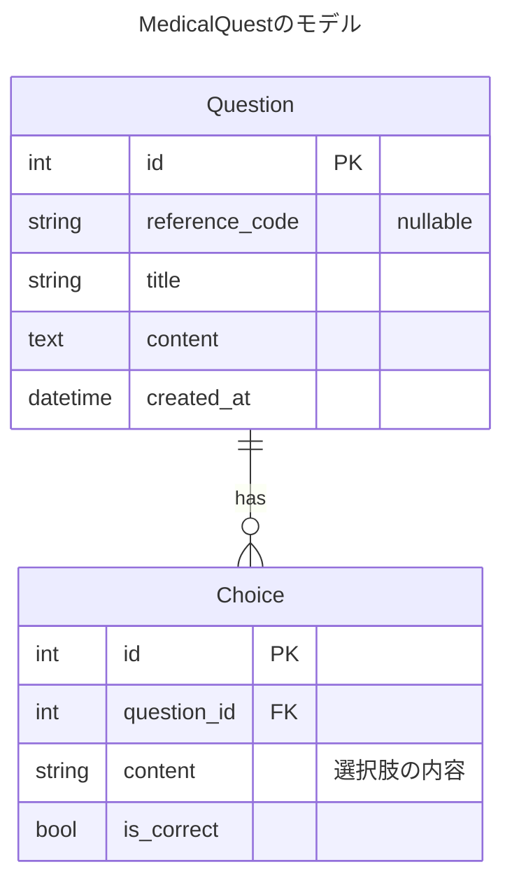

# 設計

## データベース設計



## アーキテクチャ設計

MedicalQuestは以下のようなレイヤードアーキテクチャで構築されます：

```
+-------------------+
|       CLI         |  ユーザーインターフェース
+--------+----------+
         |
         v
+-------------------+
|     API Server    |  HTTPリクエスト処理（Echo）
+--------+----------+
         |
         v
+-------------------+
|     Handlers      |  リクエストの検証と応答のフォーマット
+--------+----------+
         |
         v
+-------------------+
|     Services      |  ビジネスロジック
+--------+----------+
         |
         v
+-------------------+
|   Repositories    |  データアクセス抽象化
+--------+----------+
         |
         v
+-------------------+
|       Ent         |  データベースORM
+--------+----------+
         |
         v
+-------------------+
|    PostgreSQL     |  データストレージ
+-------------------+
```

# 必要な機能
## 利用者側
### 出題機能
- 問題文を表示する
- 回答の選択肢を表示する
- 保持している問題数分だけ上記を繰り返す

### 回答機能
- ユーザーが回答を選択肢から選択できる

### 正誤判定機能
- ユーザが入力した選択肢と正解の選択肢を突合し、正誤を判定し、ユーザに結果を表示する

### 回答結果出力機能
- すべての出題に対して回答が完了した時点、もしくは途中でCLIを終了した場合、そこまでの回答内容のサマリをCSV出力で表示する
- ファイルの内容は以下のようになっていること
  - 正誤のサマリがある
    - 実施日時、正答数、正答率
  - 正誤の詳細が問題ごとに表示されている
    - 問題番号、問題文、ユーザの回答、正解の回答

## 管理者側
### 問題登録
- 問題文の登録
- 問題の回答の選択肢を登録できる

# 技術要件
## 言語
- Go言語を利用する

## UIの提供
- CLIを実装する

## 機能の提供
- データの取得などはAPIを経由すること
  - CLIはAPIサーバーにHTTPリクエストを送信して機能を実現する

## 問題データの永続化
- RDSで永続化する
- Postgresを利用すること
- データへのアクセスはORMを利用し、ORMはent.を利用
  - https://entgo.io/

## データベーススキーマ管理
- Atlasを利用する
  - https://atlasgo.io/

## APIサーバについて
- 可能な限り軽量かつ、構築しやすいフレームワークを利用する
- この観点でechoを利用する
  - https://echo.labstack.com/

# 開発環境について
- Dockerで構築する
  - APIサーバー、CLIアプリケーション、PostgreSQLをコンテナ化
- これによって移植性を高めること

# 実装詳細

## CLIアプリケーション
- ユーザーからの入力を受け付ける
- APIサーバーとHTTP通信を行い、問題の取得や回答の送信を行う
- 結果を表示し、CSV形式でエクスポートする

## APIサーバー
- RESTful APIを提供
- 問題と選択肢のCRUD操作を実装
- 認証機能（将来的な拡張）

## データベース
- PostgreSQLを使用
- マイグレーションはAtlasで管理
- ORMはEntを使用

## デプロイメント
- コンテナ化されたアプリケーションをAWS ECSなどで実行（将来的な拡張）