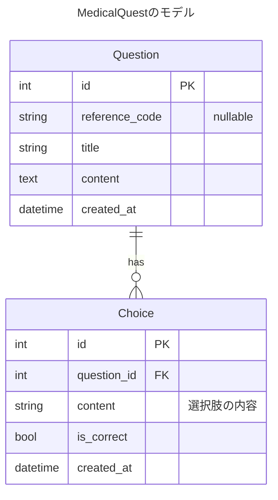

# MedicalQuest アーキテクチャ設計

## データベース設計



## アーキテクチャ設計

MedicalQuestはオニオンアーキテクチャに近い形で構築されています：

```
+---------------------+
|                     |
|     Application     | コマンドライン(CLI)やWeb API(Echo)などの
|       Layer         | 外部とのインターフェース
|                     |
+----------+----------+
           |
           v
+----------+----------+
|                     |
|      Domain         | ビジネスロジックを含むドメイン層
|       Layer         | (Entity, Repository Interface)
|                     |
+----------+----------+
           |
           v
+----------+----------+
|                     |
|  Infrastructure     | 技術的な実装（DB接続、ORM等）
|       Layer         |
|                     |
+---------------------+
```

## パッケージ構造

```
medicalquest/
├── cmd/                    # アプリケーションのエントリーポイント
│   ├── api/                # API サーバー (Echo)
│   └── cli/                # CLI アプリケーション
│
├── config/                 # アプリケーション設定
│
├── domain/                 # ドメイン層
│   ├── entity/             # ドメインエンティティ
│   └── repository/         # リポジトリインターフェース
│
├── service/                # サービス層（ユースケース実装）
│
├── handler/                # HTTPハンドラー
│
├── infrastructure/         # インフラストラクチャ層
│   ├── database/           # データベース接続
│   ├── ent/                # Ent ORM 生成コード
│   │   └── schema/         # Entスキーマ定義
│   └── persistence/        # リポジトリ実装
│
├── migrations/             # Atlas マイグレーションファイル
└── pkg/                    # 汎用的なパッケージ
```

## 依存関係の流れ

1. `cmd/api/main.go` - アプリケーション起動時に依存関係を構築
2. `handler` - HTTPルーティングとリクエスト処理
3. `service` - ビジネスロジック実装、domainのリポジトリインターフェースを使用
4. `domain/repository` - データアクセスのインターフェース
5. `infrastructure/persistence` - リポジトリインターフェースの実装
6. `infrastructure/ent` - Entによるデータベースアクセス

## 実装詳細

### APIサーバー (cmd/api)

- Echo を使用したREST APIの実装
- ルーティング設定、ミドルウェア設定
- 依存関係の構築と注入

### CLI アプリケーション (cmd/cli)

- ユーザーインターフェース実装
- 問題の表示、回答の収集、結果の表示
- CSVファイルへの結果出力

### エンティティ (domain/entity)

- 問題（Question）と選択肢（Choice）のドメインモデル
- ビジネスルールやロジックのカプセル化

### リポジトリ (domain/repository)

- データアクセスの抽象化インターフェース
- サービス層とデータソースの分離

### サービス (service)

- ユースケースの実装
- リポジトリを使用してデータアクセスを行う
- ビジネスロジックの調整

### リポジトリ実装 (infrastructure/persistence)

- domain/repository インターフェースの実装
- Ent ORMを使用したデータベースアクセス

### Ent スキーマ (infrastructure/ent/schema)

- Question エンティティと Choice エンティティの定義
- リレーションシップの定義

## 機能・要件

### 出題機能
- 問題と選択肢の取得
- CLI画面での表示

### 回答機能
- ユーザー入力の処理
- 選択肢の選択

### 正誤判定機能
- 選択された回答と正解の比較
- 結果の表示

### 結果出力機能
- 回答結果のサマリー生成
- CSVファイルへの出力

### データベースマイグレーション
- Atlas を使用したスキーマ管理
- マイグレーションの適用

## 開発フロー

1. Entスキーマの更新
2. Entコードの生成
3. マイグレーションファイルの生成と適用
4. リポジトリインターフェースの実装
5. サービス層の実装
6. ハンドラーの実装

## デプロイメント

Dockerコンテナを使用して、以下のサービスをデプロイ：

1. APIサーバー - RESTful APIを提供
2. CLIアプリケーション - ユーザーインターフェース
3. PostgreSQLデータベース - データ永続化